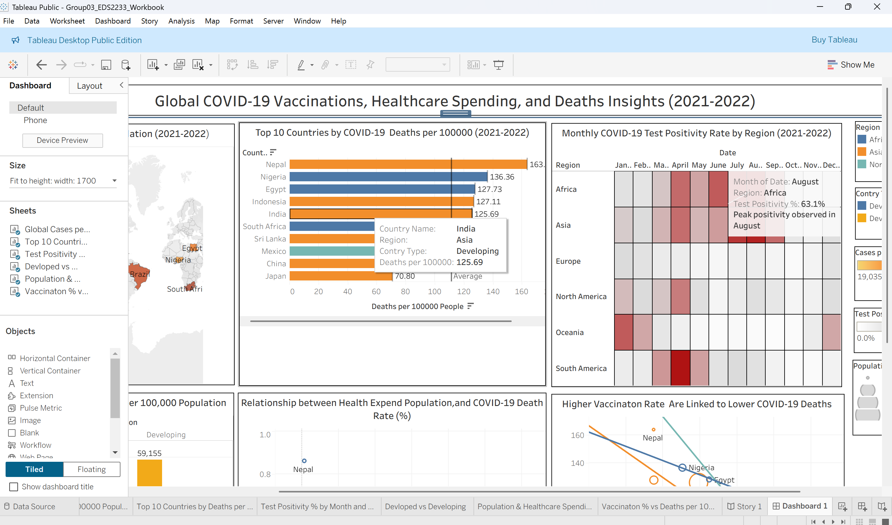

# COVID-19 Global Impact Analysis — Tableau Dashboard

## Overview
An interactive Tableau workbook analysing the global impact of COVID-19, 
comparing outcomes across developed and developing nations.

## Visualisations
- 🗺️ Global Cases per 100,000 Population (Map)
- 💀 Top 10 Countries by Deaths per 100,000
- 💉 Vaccination Rate vs Deaths per 100,000
- 🧪 Test Positivity % by Month and Region
- 🏥 Population & Healthcare Spending vs Death Rate
- 🌍 Developed vs Developing Country Comparison

## Key Metrics Analysed
- Cases & Deaths per 100,000 population
- Test Positivity Rate (%)
- Vaccination Rate (%)
- Health Expenditure & GDP per Capita

## Tools
Tableau Desktop | Data blending | Calculated fields | Story Points
